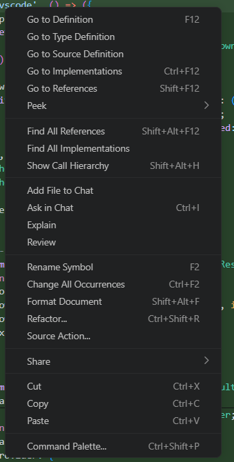

# Features to add

## Graph lineage, for aggregations

(DONE)

Currently it can provide a trace through the model on a column level for "asdfsf" + "adsaf" columns. Looks fancy. Example fullname -> firstname, lastname.
However,it can't visualize aggregations correctly, like count(orders). It should be able to at least visualize these aggregations somehow. Maybe a dotted line or something to the model where it is origin is (like orders for count(orders))

## Process bridge improvment considerations

(DONE)

They're completely separable. The four sqlglot handlers (parse_document, get_column_lineage, get_scope_columns, get_columns) are:

Zero dbt imports
Zero filesystem access
Zero database access
Zero shared mutable state between handlers
All data comes from the request JSON, all work is local
They could run in a second bridge process that doesn't even import dbt. The current serialization is an artifact of everything going through one process and one stdin pipe — not a requirement.

Two options:

A) Second Python process — spawn a "sqlglot worker" alongside the existing bridge. Same Python, same vendored sqlglot, no dbt. Give it its own BridgeRunner. Parse/scope_columns/lineage go there, dbt commands go to the existing bridge. Both can run simultaneously.

B) Async dispatch in the existing bridge — use threading or asyncio to handle sqlglot requests while a dbt command is running. More complex, same process.

Option A is simpler and cleaner — two processes, clear separation, no threading concerns. The only cost is a second Python process (~30-50MB of memory, but no dbt import so startup is fast).

This would mean: a hover during a dbt run doesn't have to wait for the run to finish. parse_document and scope_columns would be completely non-blocking relative to dbt commands.

## Performance info

C:\Development\dbt_oatanalytics\target\perf_info.json

Have intersting information that we should look into.

## Build profiler

(DONE)

Have something running in the background that can profile models in the database.

## Unit testing

Code action > Generate unit test for this model/CTE.

## copilot tools

It's a pretty big difference between running the copilot tools in the extension vs how they felt when running them with MCP. The progress reporting was way better with the old MCP tools. However, now that we are INSIDE vscode, with an extension I expect us to be able to improve on the visual feedback of the tools. Lets investigate this and figure out a good progress reporting for the tools like test/run/build etc.

## No more fluff

Make replacement for SQL fluff. Completely. Formatting and .. well we have syntax checks already. However, we might want to see if we can do a semantic or pattern type of checks too .. maybe (otherwise we can just use sqlfluff for some of these checks). But i mean, we have the parser. how hard can it be :D

## Cool new provider features

VS Code has a rich context menu of language features. We already cover most of them, but a few are missing or incomplete. Example from VS Code:

**Missing providers:**

- **Call Hierarchy** (`CallHierarchyProvider`) — "Show Call Hierarchy" (Shift+Alt+H). Re-invent call stack but for dbt — lineage surfaced the way a coder would have it. Native tree panel with incoming callers (who refs this model) and outgoing calls (what this model refs). Keyboard-driven, not a graph.
- **Document Highlights** (`DocumentHighlightProvider`) — powers "Change All Occurrences" (Ctrl+F2). Highlights same-symbol occurrences in the file. Without it, Ctrl+F2 falls back to dumb text matching.
- **Type Definition** (`TypeDefinitionProvider`) — "Go to Type Definition". Cursor on a column → jump to its schema.yml definition. Or cursor on a `ref()` → jump to the YAML model entry instead of the .sql file.
- **Refactor code actions** (`CodeActionKind.Refactor`) — "Refactor..." sub-menu. Extract selection into a new CTE, inline a CTE, extract model into a separate file.

**Incomplete providers:**

- **Rename** — currently only renames `ref('model')` and the .sql file. Should also rename CTE names (with all in-file references), column aliases, source names, and macro names.

## Structure-aware smart completion

Because we have a real SQL parser (sqlglot), completions can understand query structure and apply coordinated edits — not just insert text at the cursor. VS Code's `CompletionItem.additionalTextEdits` lets a completion atomically edit multiple locations in the document when accepted, exactly like TypeScript auto-imports.

**Examples:**

- **Auto GROUP BY** — complete a non-aggregated column in a SELECT that has a GROUP BY clause → automatically appends the column to the GROUP BY list. Pick the column once, both places update.
- **Aggregate awareness** — complete `sum(x)` or similar → any non-aggregated columns already in the SELECT get added to GROUP BY automatically.
- **Alias propagation** — complete a column alias in SELECT → offer to update matching `ORDER BY` / `HAVING` references to use the new alias.
- **CTE skeleton** — complete a CTE name that doesn't exist yet → auto-insert `with cte_name as (\n  \n)` scaffold at the top of the query.

The code action (lightbulb) variant makes sense for *existing* SQL that already has the problem (e.g. "column in SELECT not in GROUP BY"). Smart completion handles the *as-you-type* case. Both are worth implementing — they cover different moments in the workflow.

